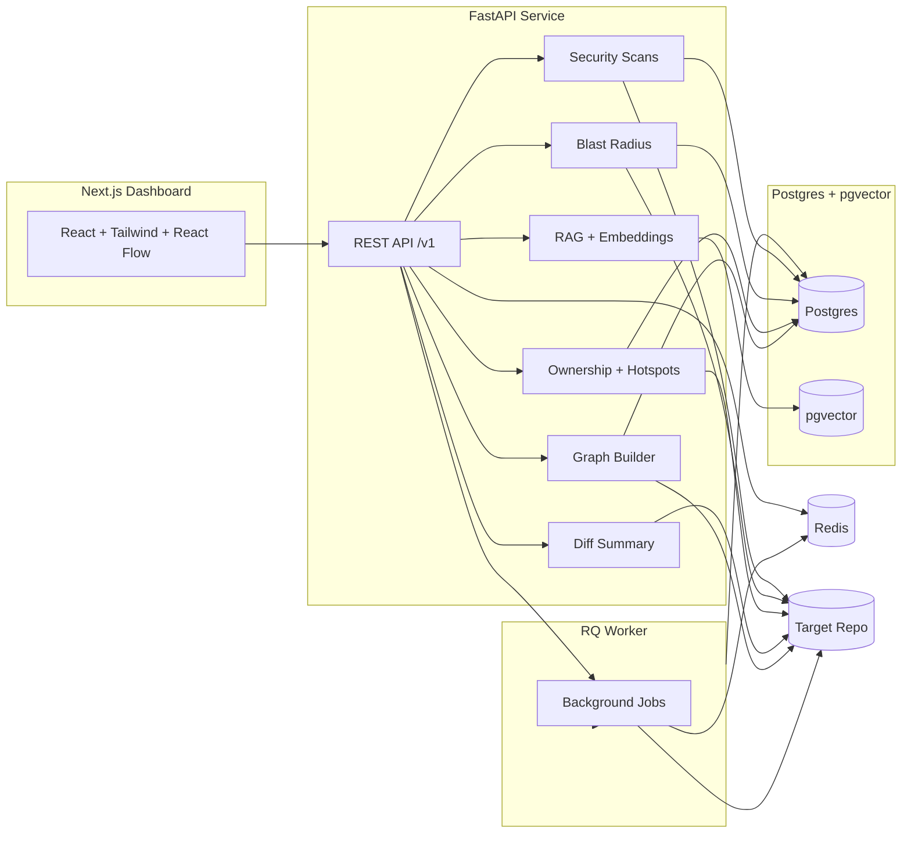

# Regulus

Talk to your codebase with graph intelligence, RAG, and blast-radius forecasting. Regulus indexes a target repo, extracts AST dependency graphs, and powers a high‑signal dashboard for architecture, ownership, hotspots, and security.

## Features

- Repo indexing pipeline with file metadata, chunking, and embeddings.
- AST dependency graph for JS/TS/Python with interactive architecture map.
- RAG search + “explain this module” with citations (OpenAI optional).
- Diff/PR summaries with risk heuristics.
- Ownership + hotspot analytics (churn × LOC × centrality).
- Blast radius prediction with confidence and rationale.
- Security scanning via Semgrep, pip-audit, and npm audit.

## Architecture

Mermaid source: `docs/architecture.mmd`



To render a diagram image:

```bash
pnpm dlx @mermaid-js/mermaid-cli -i docs/architecture.mmd -o docs/screenshots/architecture.png
```

## Screenshots (placeholders)

- `docs/screenshots/map.png`
- `docs/screenshots/blast.png`
- `docs/screenshots/hotspots.png`
- `docs/screenshots/security.png`

## Quickstart

```bash
cp .env.example .env
cp services/api/.env.example services/api/.env
cp apps/web/.env.example apps/web/.env

make up
make dev
```

Open `http://localhost:3000`.

## Demo script

Registers and indexes the current repo by default:

```bash
./scripts/demo.sh
```

Override defaults:

```bash
API_URL=http://localhost:8000 REPO_PATH=/path/to/repo REPO_NAME=MyRepo ./scripts/demo.sh
```

## Dashboard routes

- `/` repo selector
- `/repo/[id]/map` architecture graph
- `/repo/[id]/explain` RAG Q&A
- `/repo/[id]/blast` blast radius
- `/repo/[id]/hotspots` churn + ownership
- `/repo/[id]/security` scan findings

## How blast radius works

1. **Dependency reachability**: uses reverse edges in the import graph (dependents of changed nodes).
2. **Centrality**: boosts impact for nodes with high graph degree.
3. **Historical co-change**: weights files that frequently change together.
4. **Test mapping heuristic**: proposes likely tests by naming + proximity.

Confidence is a weighted blend of reachability, co-change frequency, and centrality, with human‑readable rationale per impacted file.

## Security scanning

- **Semgrep**: `semgrep --config=auto --json`
- **pip-audit**: `pip-audit --format json`
- **npm audit**: `npm audit --json`

Findings are stored and displayed on the Security page.

## Commands

- `make up` / `make down` - start/stop Postgres + Redis
- `make dev` - run API + worker + web
- `make lint` - run linters
- `make test` - run tests
- `make format` - apply formatters
- `make seed-demo` - run the demo script

## Environment variables

See `.env.example`, `services/api/.env.example`, and `apps/web/.env.example`.
